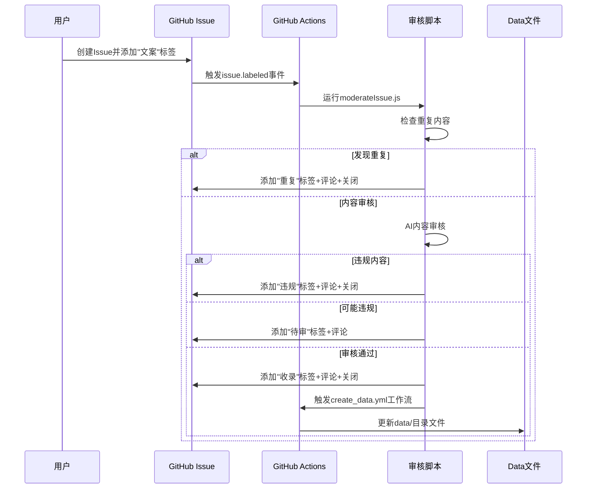
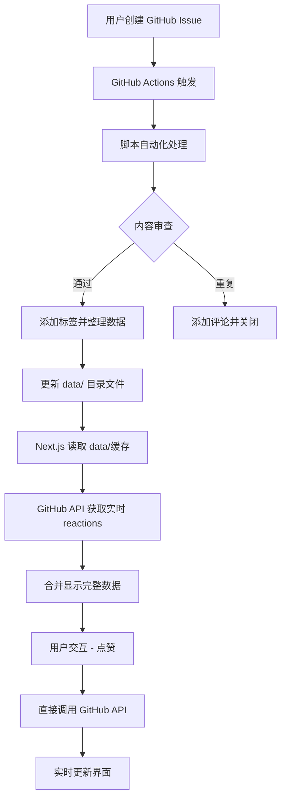

# CLAUDE.md

此文件为 Claude Code (claude.ai/code) 在本仓库中工作时提供指导。

## 项目概述

这是一个基于 Next.js 14 的"肯德基疯狂星期四段子库"应用 - 一个社区驱动的平台，用于收集和分享肯德基星期四段子。
项目使用 GitHub Issues 作为内容管理系统，并集成 GitHub OAuth 用户认证。

# context7
Always use context7 when I need code generation, setup or configuration steps, or
library/API documentation. This means you should automatically use the Context7 MCP
tools to resolve library id and get library docs without me having to explicitly ask.

## Issues 标签轮转流程

### 标签体系
项目使用以下标签对Issue进行状态管理：

#### 主要标签
- **`文案`** - 标识有效的文案提交内容
- **`收录`** - 内容审核通过，已加入段子库
- **`重复`** - 检测到重复内容，自动关闭
- **`违规`** - 检测到违规内容，自动关闭
- **`待审`** - 内容可能违规，需要人工审核

### 自动审核流程

#### 1. 触发机制
```yaml
# .github/workflows/issue_moderation.yml
on:
  issues:
    types: [labeled]
```
当Issue被添加 `文案` 标签时，自动触发审核流程。

#### 2. 审核逻辑 (`actions_scripts/src/moderationLogic.ts`)

**步骤一：重复检测**
- 使用编辑距离算法检测与现有文案的相似度
- 相似度阈值：`distance / maxLength < 0.2`
- 从本地 `data/` 目录读取所有现有文案进行对比
- 如发现重复：
  - 添加 `重复` 标签
  - 添加评论指向相似文案
  - 自动关闭Issue

**步骤二：AI内容审核**
- 调用AI审核API检查违规内容
- 检测类别：仇恨、色情、暴力、自残等
- 审核结果处理：
  - **违规内容**：添加 `违规` 标签，添加评论说明违规类别，关闭Issue
  - **可能违规**：添加 `待审` 标签，等待人工审核
  - **审核通过**：添加 `收录` 标签，关闭Issue，触发数据更新

**步骤三：数据更新**
- 如果审核通过，自动触发 `create_data.yml` 工作流
- 重新生成 `data/` 目录下的月份数据文件

#### 3. 核心函数

**重复检测**
```typescript
// 编辑距离算法
function minDistance(word1: string, word2: string): number
function isSimilar(str1: string, str2: string): boolean
function findSimilarIssue(newIssue: string, currentIssueId?: string): Promise<IssueNode | null>
```

**标签管理**
```typescript
function addLabelsToIssue(issueNumber: number, labels: string[])
function removeLabelFromIssue(issueNumber: number, label: string)
function getIssueLabels(issueNumber: number): Promise<string[]>
```

**Issue操作**
```typescript
function addCommentToIssue(issueNumber: number, comment: string)
function closeIssue(issueNumber: number)
function dispatchWorkflow(workflow_id: string, ref: string)
```

### 手动审核功能

#### 批量审核 (`actions_scripts/src/manualModeration.ts`)
- **触发方式**：手动运行 `manual_moderation.yml` 工作流
- **功能**：批量处理所有带有 `文案` 标签的开放Issue
- **支持试运行**：`DRY_RUN=true` 模式预览操作结果
- **统计报告**：输出审核统计信息

#### 审核统计
```
=== 审核统计 ===
总处理数: X
重复文案: X
违规内容: X  
审核通过: X
待审内容: X
```

### 工作流配置

#### 自动审核工作流
```yaml
# .github/workflows/issue_moderation.yml
name: 文案审核
on:
  issues:
    types: [labeled]
jobs:
  moderate-issue:
    if: github.event.label.name == '文案'
    runs-on: ubuntu-latest
    permissions:
      issues: write
      actions: write
```

#### 手动审核工作流  
```yaml
# .github/workflows/manual_moderation.yml
name: 手动文案审核
on:
  workflow_dispatch:
    inputs:
      dry_run:
        description: '是否为试运行模式'
        default: 'false'
```

#### 数据更新工作流
```yaml
# .github/workflows/create_data.yml  
name: 创建数据
on:
  workflow_dispatch:
```

### 环境变量
- **`GITHUB_TOKEN`** - GitHub API访问令牌
- **`AI_API_KEY`** - AI内容审核API密钥
- **`DRY_RUN`** - 试运行模式开关（可选）

### 标签轮转时序图



### 最佳实践

1. **标签管理**：确保Issue只被添加一次审核相关标签，避免重复处理
2. **错误处理**：所有API调用都有完整的错误处理和日志记录
3. **幂等性**：重复运行审核脚本不会产生副作用
4. **透明度**：所有自动操作都会添加评论说明原因
5. **可追溯**：完整的操作日志便于问题排查

### 调试和监控

- 查看GitHub Actions运行日志
- 检查Issue评论了解自动操作原因
- 使用试运行模式测试审核逻辑
- 监控审核统计了解内容质量趋势

## 常用命令

### Next.js 应用开发
```bash
npm run dev          # 启动开发服务器
npm run build        # 构建生产版本
npm start           # 启动生产服务器
npm run lint        # 运行 ESLint 代码检查
```

### 脚本系统开发
```bash
cd actions_scripts
npm run build        # 构建自动化脚本
npm test            # 运行脚本测试
```

### 环境配置
```bash
cp env.local.example .env.local    # 设置环境变量
```

## 双层架构设计

本项目采用**双层架构**设计，分为**脚本自动化层**和**Next.js 应用层**：

### 1. 脚本自动化层 (`actions_scripts/`)
- **职责**: GitHub Issues 内容管理和数据处理
- **技术栈**: TypeScript + GitHub Actions + Rollup
- **触发方式**: GitHub Issues 事件驱动
- **输出**: 结构化 JSON 数据文件

### 2. Next.js 应用层 (`src/`)
- **职责**: Web 应用界面和用户交互
- **技术栈**: Next.js 14 + TypeScript + Tailwind CSS
- **数据源**: 本地缓存文件 + GitHub API
- **用户界面**: 响应式 Web 应用

## 核心技术栈

- **Next.js 14** 使用 App Router
- **TypeScript** 提供类型安全
- **Tailwind CSS** 自定义肯德基主题设计系统
- **NextAuth.js** GitHub OAuth 认证
- **GitHub API** 通过 Issues 进行内容管理
- **GitHub Actions** 自动化脚本执行
- **Rollup** 脚本打包工具

## 数据流与自动化

### 双数据源架构

本项目采用**双数据源架构**，实现静态缓存与实时数据的完美结合：

#### 📁 **data/ 目录** - 静态缓存层
- **数据来源**: GitHub Actions 脚本自动生成
- **更新频率**: Issue 创建/更新时自动更新
- **数据特点**: 按月份组织的 JSON 文件，读取速度快
- **用途**: 提供段子内容、基础统计信息

#### 🔗 **GitHub API** - 实时数据层
- **数据来源**: 直接调用 GitHub GraphQL API
- **更新频率**: 实时获取最新数据
- **数据特点**: 最新的 reactions、用户交互数据
- **用途**: 点赞功能、实时统计、用户认证

### 完整数据流程



#### 1. 内容提交阶段
- 用户在 GitHub 仓库创建 Issue 提交段子内容
- GitHub Actions 自动触发脚本处理流程
- 脚本执行重复检测、内容审查

#### 2. 数据处理阶段
- 通过编辑距离算法检测重复内容
- 自动添加 `文案` 标签标记有效段子
- 按创建时间月份整理数据到对应 JSON 文件
- 更新 `data/summary.json` 统计信息

#### 3. 应用展示阶段
- **静态内容**: Next.js 读取 `data/` 目录缓存文件（段子内容、作者信息等）
- **实时数据**: 通过 GitHub API 获取最新 reactions 数据
- **数据合并**: 在 API 层将静态内容与实时数据结合
- **缓存策略**: 静态内容无需缓存，实时数据采用请求级缓存

#### 4. 用户交互阶段
- GitHub OAuth 认证用户身份
- 点赞操作直接调用 GitHub GraphQL API
- 界面实时更新，无需刷新页面

### API 接口数据源明细

#### 📁 **读取 data/ 目录的接口**
- `GET /api/items` - 获取所有段子列表
  - **数据源**: `data/{YYYY-MM}.json` 月份文件
  - **包含**: 段子内容、标题、作者信息、创建时间
  - **特点**: 快速响应，1小时缓存

- `GET /api/items/page` - 分页段子数据
  - **数据源**: `data/summary.json` + `data/{YYYY-MM}.json`
  - **包含**: 分页元数据、段子列表
  - **特点**: 按需加载，60秒缓存

- `GET /api/random` - 随机段子 (基础内容)
  - **数据源**: `data/summary.json` + 随机选择的月份文件
  - **包含**: 段子基础信息
  - **特点**: 加权随机算法，结合实时 reactions

#### 🔗 **调用 GitHub API 的接口**
- `GET /api/random` - 随机段子 (完整数据)
  - **GitHub API**: 获取实时 reactions 详情
  - **合并**: data 目录基础信息 + GitHub 实时数据
  - **返回**: 包含最新点赞数的完整段子信息

- `GET /api/reactions/[issueId]` - 单个段子的实时reactions数据
  - **GitHub API**: 获取实时 reactions 详情
  - **功能**: 为RandomJoke组件和交互式reactions提供最新数据
  - **特点**: 支持单个Issue实时查询，60秒缓存

- `POST /api/like` - 点赞操作
  - **GitHub API**: GraphQL Mutation 添加/删除 reactions
  - **功能**: 直接操作 GitHub Issue reactions
  - **认证**: 需要用户 GitHub access token

- `POST /api/submit` - 文案提交操作
  - **GitHub API**: REST API 创建 Issues
  - **功能**: 用户直接在前端提交文案，自动创建 GitHub Issue
  - **认证**: 需要用户 GitHub access token
  - **验证**: 标题≤100字符，内容≤2000字符
  - **流程**: 创建Issue → 自动触发审核流程

- `/api/auth/[...nextauth]` - 用户认证
  - **GitHub API**: OAuth 认证流程
  - **功能**: 获取用户信息和 access token
  - **数据**: 用户头像、用户名、认证令牌

### 数据同步策略

#### 静态数据更新 (data/ 目录)
- **触发**: GitHub Issue 创建/编辑事件
- **频率**: 事件驱动，实时更新
- **范围**: 段子内容、作者信息、基础元数据
- **一致性**: GitHub Actions 确保数据完整性

#### 实时数据获取 (GitHub API)
- **触发**: 用户访问、交互操作
- **频率**: 按需获取，无预设缓存
- **范围**: reactions 统计、用户交互状态
- **性能**: GraphQL 批量查询优化

## 脚本自动化系统

### actions_scripts/ 目录结构
```
actions_scripts/
├── src/
│   ├── createData.ts        # 数据文件生成脚本
│   ├── moderateIssue.ts     # Issue 审查处理
│   ├── manualModeration.ts  # 手动审查工具
│   ├── moderationLogic.ts   # 审查逻辑核心
│   └── utils/
│       ├── index.ts         # 工具函数集合
│       ├── fetchIssues.ts   # GitHub API 封装
│       └── removeSeparator.ts # 内容格式化
├── dist/                    # 编译输出目录
└── package.json            # 脚本依赖管理
```

### 核心脚本功能

#### 1. moderateIssue.ts - Issue 自动审查
- **触发时机**: GitHub Issue 创建/更新事件
- **主要功能**:
  - 重复内容检测（编辑距离算法）
  - 自动添加 `文案` 标签
  - 重复内容自动关闭并添加评论
  - 调用数据更新流程

#### 2. createData.ts - 数据文件管理  
- **触发时机**: Issue 审查通过后
- **主要功能**:
  - 按月份整理段子数据
  - 生成/更新 `data/{YYYY-MM}.json` 文件
  - 更新 `data/summary.json` 统计
  - 维护数据文件一致性

#### 3. 工具函数库 (utils/)
- **GitHub API 封装**: Issue 操作、标签管理、评论添加
- **重复检测算法**: 编辑距离计算、相似度评分
- **数据处理工具**: JSON 文件读写、月份数据整理

## data/ 目录数据结构

### 数据组织方式
```
data/
├── summary.json          # 全局统计汇总
├── 2022-07.json         # 2022年7月段子数据
├── 2022-08.json         # 2022年8月段子数据
├── ...                  # 按月份组织的数据文件
└── 2025-09.json        # 最新月份数据
```

### 数据文件格式

#### summary.json - 全局统计
```json
{
  "totalItems": 253,           // 段子总数
  "months": [
    {
      "month": "2025-09",      // 月份标识
      "count": 3               // 该月段子数量
    }
  ],
  "updatedAt": "2025-09-18T05:41:30.916Z"  // 最后更新时间
}
```

#### {YYYY-MM}.json - 月份数据文件
```json
[
  {
    "id": "issue-number",        // GitHub Issue 编号
    "title": "段子标题",         // Issue 标题
    "body": "段子内容",          // Issue 内容
    "author": {
      "login": "username",       // 作者用户名
      "avatar_url": "...",       // 作者头像
      "html_url": "..."          // 作者主页
    },
    "created_at": "2022-07-28T12:00:00Z",  // 创建时间
    "reactions": {
      "+1": 15,                  // 点赞数
      "heart": 5,                // 心形表情数
      "laugh": 8                 // 笑脸表情数
    },
    "html_url": "...",          // Issue 链接
    "labels": ["文案"]          // 标签列表
  }
]
```

### 数据更新机制
- **触发方式**: GitHub Actions 在 Issue 创建/更新时自动触发
- **处理流程**: 
  1. 脚本读取所有带有 `文案` 标签的 Issues
  2. 按创建时间的年月分组整理数据
  3. 更新对应月份的 JSON 文件
  4. 重新计算并更新 summary.json 统计信息
- **数据一致性**: 每次更新都会完整重建数据文件确保一致性

## Next.js 应用层架构

### 项目结构
```
src/
├── app/                    # Next.js 14 App Router
│   ├── api/               # API 路由
│   │   ├── auth/         # NextAuth.js 认证处理
│   │   │   └── [...nextauth]/
│   │   ├── items/        # 段子内容 API
│   │   │   ├── route.ts  # 获取所有段子
│   │   │   └── page/     # 分页接口
│   │   ├── random/       # 随机段子 API
│   │   ├── stats/        # GitHub 统计 API
│   │   ├── like/         # 点赞操作 API
│   │   └── submit/       # 文案提交 API
│   ├── auth/signin/      # 登录页面
│   ├── jokes/           # 段子列表页面
│   ├── leaderboard/     # 用户排行榜页面
│   ├── submit/          # 文案提交页面
│   ├── layout.tsx       # 根布局文件
│   └── page.tsx         # 首页
├── components/
│   ├── client/          # 客户端交互组件
│   │   ├── CopyButton.tsx        # 复制按钮
│   │   ├── InteractiveReactions.tsx  # 交互式表情
│   │   ├── JokesPagination.tsx   # 分页组件
│   │   ├── LikeButton.tsx        # 点赞按钮
│   │   ├── LoginButton.tsx       # 登录按钮
│   │   ├── RandomJoke.tsx        # 随机段子
│   │   ├── StarField.tsx         # 星空背景
│   │   └── SubmitJoke.tsx        # 文案提交表单
│   └── server/          # 服务端渲染组件
│       ├── Jokes.tsx           # 段子列表
│       └── Leaderboard.tsx     # 排行榜
├── lib/                 # 工具库和配置
│   ├── auth.ts         # NextAuth 配置
│   ├── env.ts          # 环境变量验证
│   └── server-utils.ts # 服务端工具函数
├── types/              # TypeScript 类型定义
│   ├── index.ts        # 通用类型
│   ├── next-auth.d.ts  # NextAuth 类型扩展
│   └── server-auth.d.ts # 服务端认证类型
├── styles/             # 样式文件
│   ├── base.css        # 基础样式
│   ├── components.css  # 组件样式
│   ├── tailwind.css    # Tailwind 配置
│   ├── typography.css  # 字体样式
│   └── utilities.css   # 工具样式
└── hooks/              # React Hooks
    └── useReactionData.ts  # 反应数据钩子
```

### 关键组件说明

#### API 路由层
- **数据获取**: 读取 `data/` 目录缓存文件提供快速响应
- **实时数据**: 通过 GitHub API 获取最新 reactions 和统计数据
- **认证集成**: NextAuth.js 处理 GitHub OAuth 流程
- **缓存策略**: 5分钟缓存间隔平衡性能与实时性

#### 用户界面层
- **服务端渲染**: 段子列表和排行榜使用 RSC 提升性能
- **客户端交互**: 点赞、复制、分页等交互功能
- **响应式设计**: 移动优先的 Tailwind CSS 设计系统
- **主题定制**: 肯德基品牌色彩和动画效果

## 环境变量配置

### 必需的环境变量
完整功能所需的环境变量配置：

```bash
# GitHub 集成
GITHUB_TOKEN=ghp_xxxxxxxxxxxx           # GitHub Personal Access Token
GITHUB_CLIENT_ID=Iv1.xxxxxxxxxxxxxxxx   # GitHub OAuth 应用客户端 ID  
GITHUB_CLIENT_SECRET=xxxxxxxxxxxx       # GitHub OAuth 应用密钥

# NextAuth.js 认证
NEXTAUTH_SECRET=your-secret-key          # NextAuth.js 加密密钥（32字符+）
NEXTAUTH_URL=http://localhost:3000       # OAuth 回调的基础 URL（生产环境需更改）
```

### 获取 GitHub 凭据
1. **Personal Access Token**: GitHub Settings > Developer settings > Personal access tokens
   - 需要权限：`repo`, `read:user`
2. **OAuth 应用**: GitHub Settings > Developer settings > OAuth Apps
   - 创建新应用获取 Client ID 和 Secret

完整配置模板参见 `env.local.example`。

## 开发指南

### 肯德基主题设计系统
项目基于 Tailwind CSS 构建的自定义设计系统：

#### 品牌色彩
- **主红色**: `#E02020` - 肯德基经典红色
- **主黄色**: `#FFC72C` - 肯德基黄色
- **渐变效果**: 红黄渐变营造温暖氛围

#### 自定义动画
- **炸鸡旋转**: 页面加载时的有趣交互
- **脉冲效果**: 按钮悬停状态
- **浮动元素**: 星空背景动画
- **弹性变换**: 点击反馈动效

#### 字体配置
- **主字体**: Inter - 现代简洁的无衬线字体
- **展示字体**: Mona Sans - GitHub 设计的专业字体
- **中文支持**: 系统默认中文字体栈

### GitHub 数据集成

#### Issues 作为 CMS
- **内容标识**: 带有 `文案` 标签的 Issues 作为有效段子
- **数据结构**: Issue 标题、内容、作者信息、创建时间
- **互动数据**: GitHub Reactions 作为点赞系统数据源

#### 用户系统集成
- **身份验证**: 通过 GitHub OAuth 实现免注册登录
- **用户资料**: 直接使用 GitHub 用户头像和信息
- **权限管理**: 登录用户可进行点赞等互动操作

#### 实时统计
- **排行榜**: 基于用户收到的总 reactions 数量排名
- **热度计算**: 综合点赞数、评论数、表情反应数
- **数据缓存**: API 层面实现缓存减少 GitHub API 调用

### API 接口规范

#### 公开接口
- `GET /api/random` - 获取随机段子
  - 支持 `format=text` 参数返回纯文本
  - 支持 `format=json` 返回完整数据对象
- `GET /api/items` - 获取所有段子列表
  - 支持分页参数 `page` 和 `limit`
- `GET /api/items/page` - 分页段子数据
- `GET /api/stats` - GitHub 仓库统计信息

#### 认证接口  
- `POST /api/like` - 点赞/取消点赞操作
  - 需要 GitHub OAuth 认证
  - 直接操作 GitHub Issue Reactions

- `POST /api/submit` - 文案提交操作
  - 需要 GitHub OAuth 认证
  - 创建新的 GitHub Issue
  - 自动触发审核流程

### 开发最佳实践

#### TypeScript 配置
- **严格模式**: 启用所有严格类型检查
- **自定义类型**: `src/types/index.ts` 定义业务数据类型
- **API 类型**: 完整的 GitHub API 响应类型定义
- **组件类型**: Props 接口和 Hooks 返回类型

#### 性能优化
- **服务端渲染**: 列表页使用 RSC 提升首屏性能
- **数据缓存**: API 层 5 分钟缓存策略
- **图片优化**: Next.js Image 组件优化头像加载
- **代码分割**: 客户端组件按需加载

#### 错误处理
- **API 错误**: 统一错误响应格式
- **用户提示**: 友好的错误信息展示
- **降级策略**: GitHub API 限制时的备选方案
- **日志记录**: 生产环境错误监控

## 部署说明

### Vercel 部署（推荐）
1. 连接 GitHub 仓库到 Vercel
2. 配置环境变量
3. 自动部署 main 分支更新

### GitHub Actions 工作流
- **自动化脚本**: 在 Issues 变更时触发数据更新
- **构建测试**: PR 时自动运行测试用例
- **部署流程**: 通过脚本确保数据一致性

## 前端文案贡献功能

### 功能概述
用户可以直接在网站前端提交文案，无需手动创建 GitHub Issue。系统会自动创建 Issue 并触发审核流程。

### 技术实现

#### 1. 前端组件 (`src/components/client/SubmitJoke.tsx`)
- **用户认证检查**: 需要 GitHub 登录才能提交
- **表单验证**: 
  - 标题：≤100字符
  - 内容：≤2000字符
- **提交状态管理**: 加载状态、成功/失败反馈
- **用户体验**: 字符计数、实时验证、友好提示

#### 2. API 接口 (`src/app/api/submit/route.ts`)
- **认证验证**: 检查用户 GitHub OAuth 状态
- **参数验证**: 后端二次验证表单数据
- **GitHub API 调用**: 使用用户 access token 创建 Issue
- **错误处理**: 详细的错误分类和用户友好的错误信息

#### 3. 页面路由 (`src/app/submit/page.tsx`)
- **响应式设计**: 适配移动端和桌面端
- **品牌风格**: 符合肯德基主题的视觉设计
- **引导说明**: 提交须知和功能介绍

### 用户流程

1. **访问提交页面**: 点击导航栏"贡献文案"按钮
2. **登录验证**: 未登录用户显示登录提示
3. **填写表单**: 输入文案标题和内容
4. **提交验证**: 前端实时验证字符限制
5. **API 提交**: 后端创建 GitHub Issue
6. **自动审核**: 触发现有的标签轮转流程
7. **结果反馈**: 显示提交成功或错误信息

### 与现有系统集成

#### 无缝对接审核流程
- 创建的 Issue 自动触发现有的审核机制
- 重复检测、AI 内容审核、标签管理全部复用
- 审核通过后自动更新 data/ 目录数据

#### 权限与安全
- 使用用户自己的 GitHub access token
- 遵循 GitHub API 权限模型
- 前后端双重验证确保数据安全

#### 用户体验优化
- 提交成功后清空表单
- 详细的错误信息指导用户修正
- 与现有登录系统无缝集成

### 导航集成
在主布局文件中新增"贡献文案"导航项：
```tsx
<a href="/submit"
   className="flex items-center gap-1 rounded-xl bg-kfc-yellow/20 px-3 py-2 text-sm font-medium text-white transition-all duration-300 hover:bg-kfc-yellow/30 border border-kfc-yellow/50">
  <i className="fa fa-plus"></i>
  贡献文案
</a>
```

### 类型定义
新增提交相关的 TypeScript 类型：
```typescript
interface SubmitJokeRequest {
  title: string
  content: string
}

interface SubmitJokeResponse {
  success: boolean
  message: string
  issueUrl?: string
  issueNumber?: number
}
```

### 特性亮点
- **零门槛贡献**: 用户无需了解 GitHub 操作
- **实时反馈**: 即时的表单验证和提交状态
- **自动集成**: 完全融入现有的审核和数据管理流程
- **移动友好**: 响应式设计适配各种设备
- **错误恢复**: 详细的错误处理和用户指导