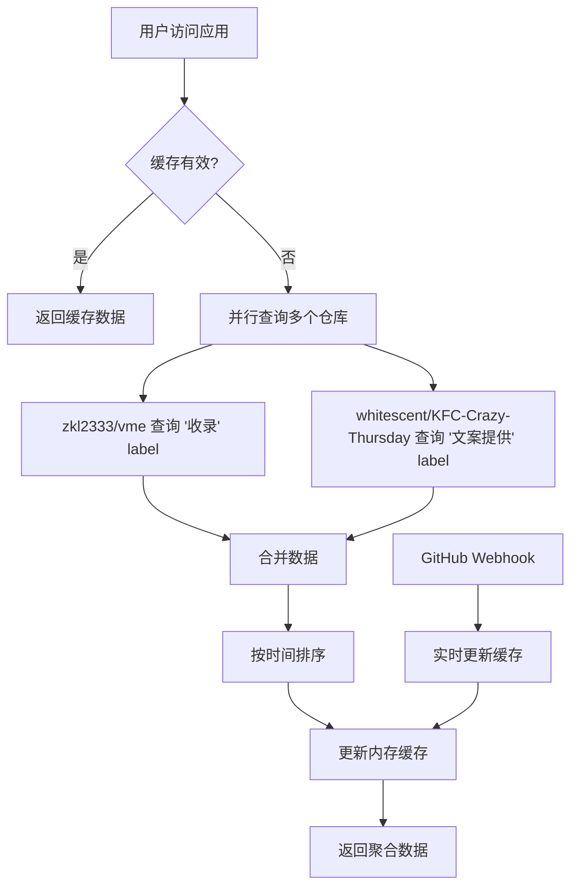

# CLAUDE.md

此文件为 Claude Code (claude.ai/code) 在本仓库中工作时提供指导。

## 项目概述

这是一个基于 Next.js 14 的"肯德基疯狂星期四段子库"应用 - 一个社区驱动的平台，用于收集和分享肯德基星期四段子。
项目使用 GitHub Issues 作为内容管理系统，并集成 GitHub OAuth 用户认证。

### 🚀 最新架构升级

项目现已支持**直接从 GitHub Issues 获取数据**，不再强依赖 data 目录：

- ✅ **MultiRepoGitHubDatabase** - 多仓库聚合数据库系统
- ✅ **内存缓存机制** - 5分钟 TTL 缓存提升性能
- ✅ **增量同步** - 智能增量更新减少 API 调用
- ✅ **可配置状态** - 支持查询 OPEN/CLOSED/ALL 状态的 issues
- ✅ **Webhook 支持** - 实时响应 GitHub 事件

## 常用命令

### Next.js 应用开发

```bash
npm run dev          # 启动开发服务器
npm run build        # 构建生产版本
npm start           # 启动生产服务器
npm run lint        # 运行 ESLint 代码检查
npm test            # 运行单元测试
npm run test:watch  # 监视模式运行测试
npm run test:coverage # 运行测试覆盖率报告
```

### 脚本系统开发

```bash
cd actions_scripts
npm run build        # 构建自动化脚本
npm test            # 运行脚本测试
```

### 环境配置

```bash
cp env.local.example .env.local    # 设置环境变量
```

## 架构设计

### MultiRepoGitHubDatabase 数据库系统

项目直接从 GitHub Issues 获取数据，支持多仓库聚合：

#### 核心组件

- **MultiRepoGitHubDatabase** (`src/lib/multi-repo-github-db.ts`)
  - 多仓库聚合查询
  - 内存缓存（5分钟 TTL）
  - 增量同步机制
  - 可配置 issue 状态（OPEN/CLOSED/ALL）
  - Webhook 实时更新支持

#### 数据源配置

```typescript
// src/lib/github-server-utils.ts
const REPOS_CONFIG: Repository[] = [
  {
    owner: 'zkl2333',
    name: 'vme',
    label: '收录',
    state: 'ALL', // 查询所有状态
  },
  {
    owner: 'whitescent',
    name: 'KFC-Crazy-Thursday',
    label: '文案提供',
    state: 'ALL',
  },
]
```

#### 特性

- ✅ 无需 data 目录，数据实时从 GitHub 获取
- ✅ 自动聚合多个仓库的数据
- ✅ 内存缓存提升性能，减少 API 调用
- ✅ 支持增量同步，只获取新数据
- ✅ 灵活配置每个仓库的查询条件

## 核心技术栈

- **Next.js 14** 使用 App Router
- **TypeScript** 提供类型安全
- **Tailwind CSS** 自定义肯德基主题设计系统
- **NextAuth.js** GitHub OAuth 认证
- **GitHub API** 通过 Issues 进行内容管理
  - **统一 API 架构** (`src/lib/github/`) - GitHub API 管理模块
  - 类型安全的 GraphQL 查询和 Mutations
  - 智能 Token 管理
- **GitHub Actions** 自动化脚本执行
- **Rollup** 脚本打包工具

## 数据流与自动化

### MultiRepoGitHubDatabase 数据流

数据流程：


```mermaid
flowchart TD
    A[用户访问应用] --> B{缓存有效?}
    B -->|是| C[返回缓存数据]
    B -->|否| D[并行查询多个仓库]
    D --> E[zkl2333/vme 查询 '收录' label]
    D --> F[whitescent/KFC-Crazy-Thursday 查询 '文案提供' label]
    E --> G[合并数据]
    F --> G
    G --> H[按时间排序]
    H --> I[更新内存缓存]
    I --> J[返回聚合数据]
    K[GitHub Webhook] --> L[实时更新缓存]
    L --> I
```

#### 核心特性

1. **智能缓存机制**

   - 5分钟 TTL 内存缓存
   - 自动失效重新获取
   - 预热缓存功能

2. **多仓库聚合**

   - 并行查询提升性能
   - 自动去重和排序
   - 统计各仓库数据量

3. **增量同步**

   - 只获取最新的 issues
   - 客户端时间过滤
   - 减少 API 调用次数

4. **灵活配置**
   ```typescript
   {
     owner: 'zkl2333',
     name: 'vme',
     label: '收录',
     state: 'ALL'  // 'OPEN' | 'CLOSED' | 'ALL'
   }
   ```

## 脚本自动化系统

### actions_scripts/ 目录结构

```
actions_scripts/
├── src/
│   ├── createData.ts        # 数据文件生成脚本
│   ├── moderateIssue.ts     # Issue 审查处理
│   ├── manualModeration.ts  # 手动审查工具
│   ├── moderationLogic.ts   # 审查逻辑核心
│   └── utils/
│       ├── index.ts         # 工具函数集合
│       ├── fetchIssues.ts   # GitHub API 封装
│       └── removeSeparator.ts # 内容格式化
├── dist/                    # 编译输出目录
└── package.json            # 脚本依赖管理
```

### 核心脚本功能

#### 1. moderateIssue.ts - Issue 自动审查

- **触发时机**: GitHub Issue 创建/更新事件
- **主要功能**:
  - 重复内容检测（编辑距离算法）
  - 自动添加 `文案` 标签
  - 重复内容自动关闭并添加评论
  - 调用数据更新流程

#### 2. createData.ts - 数据文件管理

- **触发时机**: Issue 审查通过后
- **主要功能**:
  - 按月份整理段子数据
  - 生成/更新 `data/{YYYY-MM}.json` 文件
  - 更新 `data/summary.json` 统计
  - 维护数据文件一致性

#### 3. 工具函数库 (utils/)

- **GitHub API 封装**: Issue 操作、标签管理、评论添加
- **重复检测算法**: 编辑距离计算、相似度评分
- **数据处理工具**: JSON 文件读写、月份数据整理

## data/ 目录数据结构

### 数据组织方式

```
data/
├── summary.json          # 全局统计汇总
├── 2022-07.json         # 2022年7月段子数据
├── 2022-08.json         # 2022年8月段子数据
├── ...                  # 按月份组织的数据文件
└── 2025-09.json        # 最新月份数据
```

### 数据文件格式

#### summary.json - 全局统计

```json
{
  "totalItems": 253, // 段子总数
  "months": [
    {
      "month": "2025-09", // 月份标识
      "count": 3 // 该月段子数量
    }
  ],
  "updatedAt": "2025-09-18T05:41:30.916Z" // 最后更新时间
}
```

#### {YYYY-MM}.json - 月份数据文件

```json
[
  {
    "id": "issue-number", // GitHub Issue 编号
    "title": "段子标题", // Issue 标题
    "body": "段子内容", // Issue 内容
    "author": {
      "login": "username", // 作者用户名
      "avatar_url": "...", // 作者头像
      "html_url": "..." // 作者主页
    },
    "created_at": "2022-07-28T12:00:00Z", // 创建时间
    "reactions": {
      "+1": 15, // 点赞数
      "heart": 5, // 心形表情数
      "laugh": 8 // 笑脸表情数
    },
    "html_url": "...", // Issue 链接
    "labels": ["文案"] // 标签列表
  }
]
```

### 数据更新机制

- **触发方式**: GitHub Actions 在 Issue 创建/更新时自动触发
- **处理流程**:
  1. 脚本读取所有带有 `文案` 标签的 Issues
  2. 按创建时间的年月分组整理数据
  3. 更新对应月份的 JSON 文件
  4. 重新计算并更新 summary.json 统计信息
- **数据一致性**: 每次更新都会完整重建数据文件确保一致性

## Next.js 应用层架构

### 项目结构

```
src/
├── app/                    # Next.js 14 App Router
│   ├── api/               # API 路由
│   │   ├── auth/         # NextAuth.js 认证处理
│   │   │   └── [...nextauth]/
│   │   ├── items/        # 段子内容 API
│   │   │   ├── route.ts  # 获取所有段子
│   │   │   └── page/     # 分页接口
│   │   ├── random/       # 随机段子 API
│   │   ├── stats/        # GitHub 统计 API
│   │   ├── like/         # 点赞操作 API
│   │   ├── repos/        # 仓库配置 API
│   │   └── health/       # 健康检查 API
│   ├── auth/signin/      # 登录页面
│   ├── jokes/           # 段子列表页面
│   ├── leaderboard/     # 用户排行榜页面
│   ├── layout.tsx       # 根布局文件
│   └── page.tsx         # 首页
├── components/
│   ├── client/          # 客户端交互组件
│   │   ├── CopyButton.tsx        # 复制按钮
│   │   ├── InteractiveReactions.tsx  # 交互式表情
│   │   ├── JokesPagination.tsx   # 分页组件
│   │   ├── LikeButton.tsx        # 点赞按钮
│   │   ├── LoginButton.tsx       # 登录按钮
│   │   ├── RandomJoke.tsx        # 随机段子
│   │   └── StarField.tsx         # 星空背景
│   └── server/          # 服务端渲染组件
│       ├── Jokes.tsx           # 段子列表
│       └── Leaderboard.tsx     # 排行榜
├── lib/                 # 工具库和配置
│   ├── auth.ts                    # NextAuth 配置
│   ├── env.ts                     # 环境变量验证
│   ├── server-utils.ts            # 服务端工具函数
│   ├── multi-repo-github-db.ts    # 多仓库数据库核心类
│   ├── github-server-utils.ts     # GitHub 数据库工具函数
│   └── github/                    # 统一的 GitHub API 模块
│       ├── client.ts              # Octokit 实例管理
│       ├── queries.ts             # GraphQL 查询
│       ├── mutations.ts           # GraphQL Mutations
│       ├── types.ts               # TypeScript 类型定义
│       ├── index.ts               # 统一导出
│       └── README.md              # 使用文档
├── types/              # TypeScript 类型定义
│   ├── index.ts        # 通用类型
│   ├── next-auth.d.ts  # NextAuth 类型扩展
│   └── server-auth.d.ts # 服务端认证类型
├── styles/             # 样式文件
│   ├── base.css        # 基础样式
│   ├── components.css  # 组件样式
│   ├── tailwind.css    # Tailwind 配置
│   ├── typography.css  # 字体样式
│   └── utilities.css   # 工具样式
└── hooks/              # React Hooks
    └── useReactionData.ts  # 反应数据钩子
```

### 核心模块说明

#### MultiRepoGitHubDatabase (`src/lib/multi-repo-github-db.ts`)

多仓库数据库核心类，提供：

- `getAllIssues()` - 并行获取所有仓库数据
- `warmupCache()` - 预热缓存
- `getPage()` - 分页查询
- `getRandomItem()` - 随机获取
- `getPageByRepo()` - 按仓库分页
- `syncLatest()` - 增量同步
- `handleWebhook()` - Webhook 处理

#### GitHub Server Utils (`src/lib/github-server-utils.ts`)

基于 MultiRepoGitHubDatabase 的高级工具函数：

- `getAllKfcItems()` - 获取所有段子
- `getKfcItemsWithPagination()` - 分页获取
- `getRandomKfcItem()` - 随机段子
- `getItemsByRepo()` - 按仓库获取
- `getCacheStats()` - 缓存统计
- `refreshCache()` - 手动刷新
- `syncLatestIssues()` - 增量同步
- `warmupGitHubDatabase()` - 启动预热
- `healthCheck()` - 健康检查

#### 统一 GitHub API 模块 (`src/lib/github/`)

GitHub API 管理模块，解决 API 使用分散、代码重复的问题：

##### 客户端管理 (`client.ts`)

- `getOctokitInstance(request?)` - 智能选择 token（优先用户 > 环境变量）
- `createOctokitInstance(token)` - 创建指定 token 的实例
- `getSystemOctokitInstance()` - 系统级实例（仅环境变量 token）

##### GraphQL 查询 (`queries.ts`)

- `queryRepoIssues()` - 查询仓库 Issues
- `queryRepoIssuesSince()` - 增量同步查询
- `queryIssueStats()` - 单个 Issue 统计
- `queryBatchIssueStats()` - 批量 Issue 统计
- `queryUserReaction()` - 查询用户 Reaction

##### GraphQL Mutations (`mutations.ts`)

- `addReaction()` - 添加 Reaction
- `removeReaction()` - 删除 Reaction
- `toggleReaction()` - 智能切换 Reaction

##### 类型定义 (`types.ts`)

- 完整的 GitHub API TypeScript 类型
- GraphQL 响应类型
- 查询和 Mutation 选项类型

**优势**：

- ✅ 消除代码重复（减少 ~685 行重复代码）
- ✅ 统一类型定义
- ✅ 易于维护和扩展
- ✅ 完整的文档和使用示例

### 关键组件说明

#### API 路由层

- **数据获取**: 从 MultiRepoGitHubDatabase 获取聚合的多仓库数据
- **实时数据**: 通过 GitHub API 获取最新 reactions 和统计数据
- **认证集成**: NextAuth.js 处理 GitHub OAuth 流程
- **缓存策略**: 5分钟缓存间隔平衡性能与实时性

#### 用户界面层

- **服务端渲染**: 段子列表和排行榜使用 RSC 提升性能
- **客户端交互**: 点赞、复制、分页等交互功能
- **响应式设计**: 移动优先的 Tailwind CSS 设计系统
- **主题定制**: 肯德基品牌色彩和动画效果

## 环境变量配置

### 必需的环境变量

完整功能所需的环境变量配置：

```bash
# GitHub 集成
GITHUB_TOKEN=ghp_xxxxxxxxxxxx           # GitHub Personal Access Token
GITHUB_CLIENT_ID=Iv1.xxxxxxxxxxxxxxxx   # GitHub OAuth 应用客户端 ID
GITHUB_CLIENT_SECRET=xxxxxxxxxxxx       # GitHub OAuth 应用密钥

# NextAuth.js 认证
NEXTAUTH_SECRET=your-secret-key          # NextAuth.js 加密密钥（32字符+）
NEXTAUTH_URL=http://localhost:3000       # OAuth 回调的基础 URL（生产环境需更改）
```

### 获取 GitHub 凭据

1. **Personal Access Token**: GitHub Settings > Developer settings > Personal access tokens
   - 必需权限：`repo` (完整仓库访问)
   - 可选权限：`read:user`, `read:org`
   - 用于 MultiRepoGitHubDatabase 查询多仓库数据
2. **OAuth 应用**: GitHub Settings > Developer settings > OAuth Apps
   - 创建新应用获取 Client ID 和 Secret
   - 用于用户登录和点赞功能

完整配置模板参见 `env.local.example`。

### MultiRepoGitHubDatabase 环境变量重要说明

使用 MultiRepoGitHubDatabase 时：

- **GITHUB_TOKEN 必须配置**：没有 token 无法查询数据
- 建议使用有 `repo` 完整权限的 token
- 生产环境建议配置更长的缓存时间（修改 `CACHE_TTL`）

```
src/
├── app/                    # Next.js 14 App Router
│   ├── api/               # API 路由
│   │   ├── auth/         # NextAuth.js 认证处理
│   │   │   └── [...nextauth]/
│   │   ├── items/        # 段子内容 API
│   │   │   ├── route.ts  # 获取所有段子
│   │   │   └── page/     # 分页接口
│   │   ├── random/       # 随机段子 API
│   │   ├── stats/        # GitHub 统计 API
│   │   ├── like/         # 点赞操作 API
│   │   ├── repos/        # 🆕 仓库配置 API
│   │   └── health/       # 🆕 健康检查 API
│   ├── auth/signin/      # 登录页面
│   ├── jokes/           # 段子列表页面
│   ├── leaderboard/     # 用户排行榜页面
│   ├── layout.tsx       # 根布局文件
│   └── page.tsx         # 首页
├── components/
│   ├── client/          # 客户端交互组件
│   │   ├── CopyButton.tsx        # 复制按钮
│   │   ├── InteractiveReactions.tsx  # 交互式表情
│   │   ├── JokesPagination.tsx   # 分页组件
│   │   ├── LikeButton.tsx        # 点赞按钮
│   │   ├── LoginButton.tsx       # 登录按钮
│   │   ├── RandomJoke.tsx        # 随机段子
│   │   └── StarField.tsx         # 星空背景
│   └── server/          # 服务端渲染组件
│       ├── Jokes.tsx           # 段子列表
│       └── Leaderboard.tsx     # 排行榜
├── lib/                 # 工具库和配置
│   ├── auth.ts                    # NextAuth 配置
│   ├── env.ts                     # 环境变量验证
│   ├── server-utils.ts            # 服务端工具函数（传统）
│   ├── 🆕 multi-repo-github-db.ts # 多仓库数据库核心类
│   ├── 🆕 github-server-utils.ts  # GitHub 数据库工具函数（新架构）
│   └── 🆕 github/                 # 统一的 GitHub API 模块
│       ├── client.ts              # Octokit 实例管理
│       ├── queries.ts             # GraphQL 查询
│       ├── mutations.ts           # GraphQL Mutations
│       ├── types.ts               # TypeScript 类型定义
│       ├── index.ts               # 统一导出
│       └── README.md              # 使用文档
├── types/              # TypeScript 类型定义
│   ├── index.ts        # 通用类型（包含新架构类型）
│   ├── next-auth.d.ts  # NextAuth 类型扩展
│   └── server-auth.d.ts # 服务端认证类型
├── styles/             # 样式文件
│   ├── base.css        # 基础样式
│   ├── components.css  # 组件样式
│   ├── tailwind.css    # Tailwind 配置
│   ├── typography.css  # 字体样式
│   └── utilities.css   # 工具样式
└── hooks/              # React Hooks
    └── useReactionData.ts  # 反应数据钩子
```

### 🆕 新增核心模块说明

#### MultiRepoGitHubDatabase (`src/lib/multi-repo-github-db.ts`)

多仓库数据库核心类，提供：

- `getAllIssues()` - 并行获取所有仓库数据
- `warmupCache()` - 预热缓存
- `getPage()` - 分页查询
- `getRandomItem()` - 随机获取
- `getPageByRepo()` - 按仓库分页
- `syncLatest()` - 增量同步
- `handleWebhook()` - Webhook 处理

#### GitHub Server Utils (`src/lib/github-server-utils.ts`)

基于 MultiRepoGitHubDatabase 的高级工具函数：

- `getAllKfcItems()` - 获取所有段子
- `getKfcItemsWithPagination()` - 分页获取
- `getRandomKfcItem()` - 随机段子
- `getItemsByRepo()` - 按仓库获取
- `getCacheStats()` - 缓存统计
- `refreshCache()` - 手动刷新
- `syncLatestIssues()` - 增量同步
- `warmupGitHubDatabase()` - 启动预热
- `healthCheck()` - 健康检查

#### 🆕 统一 GitHub API 模块 (`src/lib/github/`)

**重构于 2025-09-30**，解决 GitHub API 使用分散、代码重复的问题：

##### 客户端管理 (`client.ts`)

- `getOctokitInstance(request?)` - 智能选择 token（优先用户 > 环境变量）
- `createOctokitInstance(token)` - 创建指定 token 的实例
- `getSystemOctokitInstance()` - 系统级实例（仅环境变量 token）

##### GraphQL 查询 (`queries.ts`)

- `queryRepoIssues()` - 查询仓库 Issues
- `queryRepoIssuesSince()` - 增量同步查询
- `queryIssueStats()` - 单个 Issue 统计
- `queryBatchIssueStats()` - 批量 Issue 统计
- `queryUserReaction()` - 查询用户 Reaction

##### GraphQL Mutations (`mutations.ts`)

- `addReaction()` - 添加 Reaction
- `removeReaction()` - 删除 Reaction
- `toggleReaction()` - 智能切换 Reaction

##### 类型定义 (`types.ts`)

- 完整的 GitHub API TypeScript 类型
- GraphQL 响应类型
- 查询和 Mutation 选项类型

**优势**：

- ✅ 消除代码重复（减少 ~685 行重复代码）
- ✅ 统一类型定义
- ✅ 易于维护和扩展
- ✅ 完整的文档和使用示例

### 关键组件说明

#### API 路由层

- **数据获取**: 读取 `data/` 目录缓存文件提供快速响应
- **实时数据**: 通过 GitHub API 获取最新 reactions 和统计数据
- **认证集成**: NextAuth.js 处理 GitHub OAuth 流程
- **缓存策略**: 5分钟缓存间隔平衡性能与实时性

#### 用户界面层

- **服务端渲染**: 段子列表和排行榜使用 RSC 提升性能
- **客户端交互**: 点赞、复制、分页等交互功能
- **响应式设计**: 移动优先的 Tailwind CSS 设计系统
- **主题定制**: 肯德基品牌色彩和动画效果

## 环境变量配置

### 必需的环境变量

完整功能所需的环境变量配置：

```bash
# GitHub 集成
GITHUB_TOKEN=ghp_xxxxxxxxxxxx           # GitHub Personal Access Token
GITHUB_CLIENT_ID=Iv1.xxxxxxxxxxxxxxxx   # GitHub OAuth 应用客户端 ID
GITHUB_CLIENT_SECRET=xxxxxxxxxxxx       # GitHub OAuth 应用密钥

# NextAuth.js 认证
NEXTAUTH_SECRET=your-secret-key          # NextAuth.js 加密密钥（32字符+）
NEXTAUTH_URL=http://localhost:3000       # OAuth 回调的基础 URL（生产环境需更改）
```

### 获取 GitHub 凭据

1. **Personal Access Token**: GitHub Settings > Developer settings > Personal access tokens
   - 🆕 必需权限：`repo` (完整仓库访问)
   - 可选权限：`read:user`, `read:org`
   - 用于 MultiRepoGitHubDatabase 查询多仓库数据
2. **OAuth 应用**: GitHub Settings > Developer settings > OAuth Apps
   - 创建新应用获取 Client ID 和 Secret
   - 用于用户登录和点赞功能

完整配置模板参见 `env.local.example`。

### 🆕 新架构环境变量重要说明

使用 MultiRepoGitHubDatabase 时：

- **GITHUB_TOKEN 必须配置**：没有 token 无法查询数据
- 建议使用有 `repo` 完整权限的 token
- 生产环境建议配置更长的缓存时间（修改 `CACHE_TTL`）

## 开发指南

### 肯德基主题设计系统

项目基于 Tailwind CSS 构建的自定义设计系统：

#### 品牌色彩

- **主红色**: `#E02020` - 肯德基经典红色
- **主黄色**: `#FFC72C` - 肯德基黄色
- **渐变效果**: 红黄渐变营造温暖氛围

#### 自定义动画

- **炸鸡旋转**: 页面加载时的有趣交互
- **脉冲效果**: 按钮悬停状态
- **浮动元素**: 星空背景动画
- **弹性变换**: 点击反馈动效

#### 字体配置

- **主字体**: Inter - 现代简洁的无衬线字体
- **展示字体**: Mona Sans - GitHub 设计的专业字体
- **中文支持**: 系统默认中文字体栈

### GitHub 数据集成

#### Issues 作为 CMS

- **内容标识**: 带有 `文案` 标签的 Issues 作为有效段子
- **数据结构**: Issue 标题、内容、作者信息、创建时间
- **互动数据**: GitHub Reactions 作为点赞系统数据源

#### 用户系统集成

- **身份验证**: 通过 GitHub OAuth 实现免注册登录
- **用户资料**: 直接使用 GitHub 用户头像和信息
- **权限管理**: 登录用户可进行点赞等互动操作

#### 实时统计

- **排行榜**: 基于用户收到的总 reactions 数量排名
- **热度计算**: 综合点赞数、评论数、表情反应数
- **数据缓存**: API 层面实现缓存减少 GitHub API 调用

### API 接口规范

#### 公开接口

- `GET /api/random` - 获取随机段子
  - 支持 `format=text` 参数返回纯文本
  - 支持 `format=json` 返回完整数据对象
  - 🆕 从 MultiRepoGitHubDatabase 获取
- `GET /api/items` - 获取所有段子列表
  - 🆕 从 MultiRepoGitHubDatabase 聚合多仓库
  - 包含仓库统计信息
- `GET /api/items/page` - 分页段子数据
  - 支持分页参数 `page` 和 `pageSize`
  - 🆕 基于内存缓存的高性能分页
- `GET /api/stats` - GitHub 仓库统计信息
- 🆕 `GET /api/repos` - 获取按仓库分类的数据
  - 参数：`repo` (仓库key), `page`, `pageSize`
- 🆕 `POST /api/repos` - 获取所有配置的仓库列表
- 🆕 `GET /api/health` - 系统健康检查
  - 返回缓存状态、仓库配置、错误信息

#### 认证接口

- `POST /api/like` - 点赞/取消点赞操作
  - 需要 GitHub OAuth 认证
  - 直接操作 GitHub Issue Reactions

### 开发最佳实践

#### TypeScript 配置

- **严格模式**: 启用所有严格类型检查
- **自定义类型**: `src/types/index.ts` 定义业务数据类型
- **API 类型**: 完整的 GitHub API 响应类型定义
- **组件类型**: Props 接口和 Hooks 返回类型

#### 性能优化

- **服务端渲染**: 列表页使用 RSC 提升首屏性能
- **数据缓存**: API 层 5 分钟缓存策略
- **图片优化**: Next.js Image 组件优化头像加载
- **代码分割**: 客户端组件按需加载

#### 错误处理

- **API 错误**: 统一错误响应格式
- **用户提示**: 友好的错误信息展示
- **降级策略**: GitHub API 限制时的备选方案
- **日志记录**: 生产环境错误监控

## 部署说明

### Vercel 部署（推荐）

1. 连接 GitHub 仓库到 Vercel
2. 🆕 配置环境变量（必须包含 GITHUB_TOKEN）
3. 自动部署 main 分支更新
4. 🆕 首次部署后访问 `/api/health` 验证配置

### 🆕 MultiRepoGitHubDatabase 部署注意事项

#### 环境变量配置

```bash
# Vercel 环境变量配置
GITHUB_TOKEN=ghp_xxxxxxxxxxxx  # 必需！
GITHUB_CLIENT_ID=xxx
GITHUB_CLIENT_SECRET=xxx
NEXTAUTH_SECRET=xxx
NEXTAUTH_URL=https://your-domain.vercel.app
```

#### 性能优化建议

1. **缓存预热**：在 `layout.tsx` 中调用 `warmupGitHubDatabase()`
2. **监控缓存**：定期检查 `/api/health` 端点
3. **API 限制**：注意 GitHub API 频率限制（5000次/小时）
4. **增量同步**：启用定时任务调用 `syncLatestIssues()`

#### 健康检查

- 端点：`GET /api/health`
- 返回：缓存状态、仓库配置、错误信息
- 用途：监控系统运行状态

### GitHub Actions 工作流

- **自动化脚本**: 在 Issues 变更时触发数据更新（传统架构）
- **构建测试**: PR 时自动运行测试用例
- **部署流程**: 通过脚本确保数据一致性
- 🆕 **Webhook 触发**: 可配置 Webhook 实时更新缓存

## 测试

### 🆕 单元测试

项目包含完整的单元测试套件，使用 Jest 作为测试框架：

```bash
# 运行所有测试
npm test

# 运行监视模式
npm run test:watch

# 运行覆盖率报告
npm run test:coverage

# 运行特定测试文件
npm test -- __tests__/multi-repo-github-db.test.ts
```

#### 测试覆盖范围

- ✅ MultiRepoGitHubDatabase 核心功能（20个测试用例）
- ✅ 缓存机制测试
- ✅ 多仓库聚合测试
- ✅ 增量同步测试
- ✅ Webhook 处理测试
- ✅ 错误处理测试

#### 测试架构

- **测试文件位置**: `__tests__/` 目录
- **Mock 策略**: 模拟 GitHub API 和 Octokit 实例
- **测试配置**: `jest.config.js` 和 `jest.setup.ts`
- **类型支持**: 完整的 TypeScript 支持

#### 测试最佳实践

- 每个核心功能都有对应的测试用例
- 使用真实的数据结构进行测试
- 模拟网络请求避免外部依赖
- 测试错误场景和边缘情况

## 故障排查

### 🆕 MultiRepoGitHubDatabase 常见问题

#### 问题 1：获取不到数据（返回 0 条）

**症状**：API 返回空数组或 0 条数据

**排查步骤**：

1. 检查 `.env.local` 是否配置了 `GITHUB_TOKEN`
2. 验证 token 权限（需要 `repo` 权限）
3. 确认仓库配置的 label 是否正确（区分大小写）
4. 检查 issue 状态配置（`state: 'OPEN' | 'CLOSED' | 'ALL'`）
5. 访问 `/api/health` 查看详细错误信息

**调试脚本**：

使用 Bash 命令测试 GitHub API 连接：

```bash
# 检查环境变量
echo $GITHUB_TOKEN

# 测试 GitHub API 连接
curl -H "Authorization: token $GITHUB_TOKEN" \
     -H "Accept: application/vnd.github.v3+json" \
     https://api.github.com/user
```

#### 问题 2：GitHub API 限制

**症状**：403 错误，提示 API rate limit exceeded

**解决方案**：

- 使用认证的 token（限制提升到 5000次/小时）
- 增加缓存 TTL 减少 API 调用
- 使用增量同步而非全量刷新

#### 问题 3：缓存不刷新

**症状**：数据更新后前端不变

**解决方案**：

- 等待缓存过期（默认 5 分钟）
- 调用 `refreshCache()` 手动刷新
- 配置 Webhook 自动更新

## 迁移指南

### 🆕 从 data 目录迁移到 MultiRepoGitHubDatabase

#### 优势对比

| 特性       | data 目录（旧）      | MultiRepoGitHubDatabase（新） |
| ---------- | -------------------- | ----------------------------- |
| 数据来源   | JSON 文件            | GitHub Issues 直接查询        |
| 更新方式   | GitHub Actions       | 实时 API + 缓存               |
| 多仓库支持 | 需要脚本合并         | ✅ 原生支持                   |
| 实时性     | 延迟（等待 Actions） | ✅ 5分钟缓存                  |
| 部署依赖   | 需要 data 文件       | ✅ 无需文件                   |
| API 调用   | 少                   | 适中（有缓存）                |

#### 迁移步骤

1. **配置环境变量**

   ```bash
   # .env.local
   GITHUB_TOKEN=your_token_here
   ```

2. **更新仓库配置**

   ```typescript
   // src/lib/github-server-utils.ts
   const REPOS_CONFIG: Repository[] = [
     {
       owner: 'zkl2333',
       name: 'vme',
       label: '收录',
       state: 'ALL',
     },
   ]
   ```

3. **测试新 API**

   - 访问 `/api/health` 检查状态
   - 访问 `/api/items` 验证数据
   - 访问 `/api/random` 测试随机功能

4. **（可选）删除 data 目录**
   - 确认新架构工作正常后
   - 可以删除 `data/` 目录
   - 禁用相关 GitHub Actions

#### 兼容性说明

- ✅ 新旧架构可以共存
- ✅ API 接口保持兼容
- ✅ 逐步迁移，无需一次性切换
